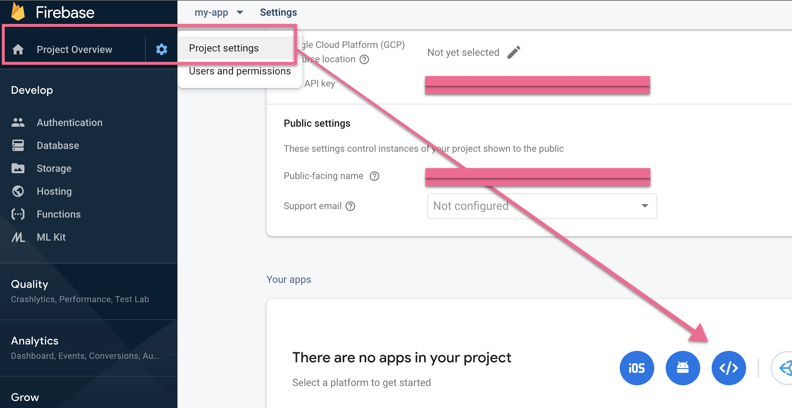
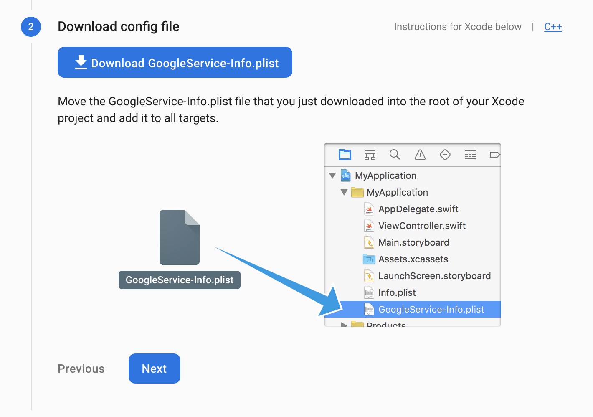
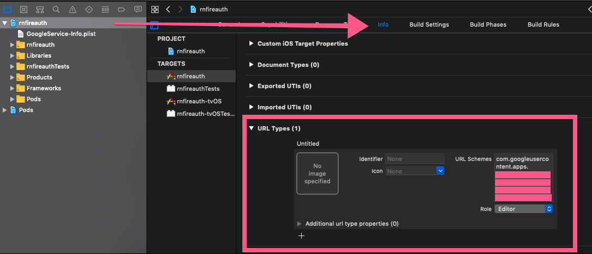
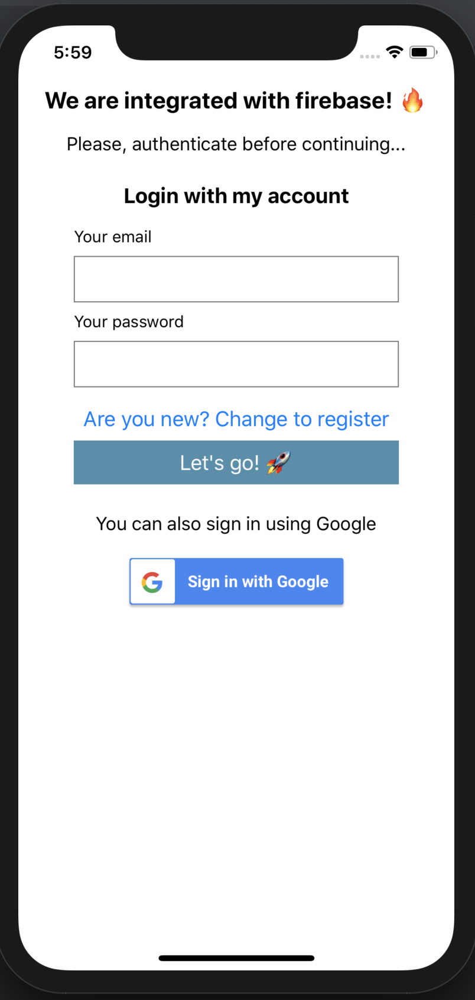
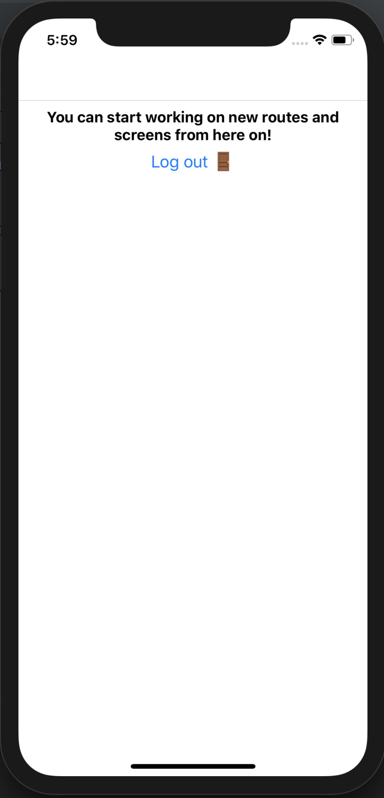

## React Native Firebase Authentication

This React Native project is built in the 0.60.5 version is a great boilerplate to start a working on a mobile application with integrated Firebase services and Google sign in! 🔥

It's prepared to support iOS out of the box, and Android manual implementation is needed for Firebase, Google Auth and Navigation.

### How can I start using it?

Just clone the project and follow this steps:

  * `npm i` in the root.
  * `react-native link` in the root, as even if using Cocoa Pods, Google Signin needs manual linking.
  *  `cd ios && pod install && cd ..` so we can install the pods and leave the folder.

We should be ready to go but both Firebase and Google Signin need credentials, to do that, we can create a project in both places.

### Firebase project

Go to `https://console.firebase.google.com/` and create a new project.

Once the project is created, navigate to Authentication and enable both email and Google authentication methods.

In the project settings General tab, scroll down and create a new App, which should be Web based. Copy the credentials into a new `.env` file in the root of the folder following the naming pattern in the `.env.dist` file.

Create now an iOS project. It'll ask for the Bundle Id, you can find that in Xcode by opening the project workspace doing this:

`open ios/rnfireauth.xcworkspace/`

In Xcode, click on the project icon and you'll get the Bundle Id in the General tab. Use that in the Firebase application field and create your project.

You should have now a `GoogleService-Info.plist` file available. Copy that into the iOS folder of your project and using Xcode, add it as a file to your project (click `Copy items if needed` option) by right clicking the project workspace name and choosing `Add Files to...`.

The last step is getting the `REVERSE_CLIENT_ID` field of that file and adding that in Xcode as a `Type URL` to your project, by scrolling down in the `Info` tab and adding a new one.

### Google Authentication

After all this, navigate to `https://console.developers.google.com`. Go to credentials, choose your project, and copy both the webClientId and iosClientId as env variables in the `.env` file too.

### Time to run the project! ⏰

After all this setup, we can run `react-native run-ios` in the root of the project and let it build.

Everything should be working out of the box and the project should start in the simulator! 💪

PS: Remember that everything was configured to work fine with iOS and Android needs some manual installation!

### Some screenshots! 📸

